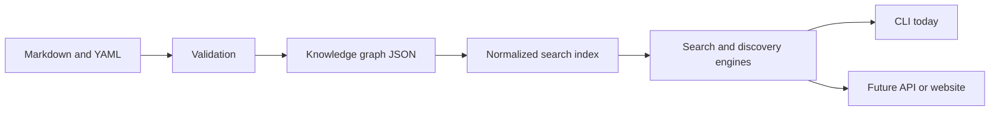

# Search and Intelligence Architecture

Phase 3 adds a reusable local intelligence layer without changing the repository’s source-of-truth model. Authors continue to edit Markdown and YAML. Existing validation checks structure, links, and typed relationships. Deterministic generators then produce the knowledge graph, normalized search index, aliases, and health report.

## Data Flow

The search layer reads committed JSON only. It does not issue network requests, execute tool commands, evaluate user-provided code, collect telemetry, send repository content to external services, or depend on a database.

## Modules

| Module | Responsibility |
| --- | --- |
| `search/indexes/index_loader.py` | Load local generated artifacts and normalize identifiers. |
| `search/ranking/ranker.py` | Apply transparent weighted ranking and stable tie-breaking. |
| `search/engine/search_engine.py` | Search normalized documents with metadata filters. |
| `search/engine/discovery_engine.py` | Traverse relationships with bounded breadth-first search. |
| `search/engine/recommendation_engine.py` | Provide rule-based educational next steps. |
| `search/engine/comparison_engine.py` | Compare known tool metadata without benchmarks. |
| `search/engine/health_engine.py` | Expose the generated knowledge-health report. |
| `scripts/search.py` | Provide a human and JSON command-line interface. |

## Determinism and Safety

Generated artifacts sort entity IDs, relationships, aliases, and output documents. Health reports use a fixed documented `as_of` date and stale threshold rather than inserting runtime timestamps. Search inputs are treated as inert text. The engine contains no shell execution, dynamic evaluation, network access, or offensive automation.

## Future Integration

A future API or website can consume the generated JSON or instantiate the engine classes. It should not parse raw Markdown for every request. A later phase may evaluate a database or specialized search service only after the local contracts, test suite, and content-health workflow are stable.
