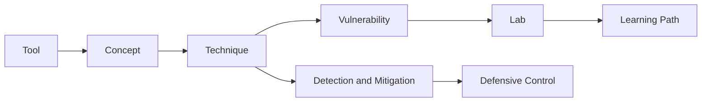

# Cybersecurity Knowledge Graph

Phase 2 introduces a Markdown + YAML knowledge graph without adding a database. The source entities are **concepts**, **techniques**, **technologies**, and **defensive controls**. Their metadata connects tools, vulnerabilities, labs, and learning paths.

## Navigation

* [Concepts](concepts/README.md)
* [Techniques](techniques/README.md)
* [Technologies](technologies/README.md)
* [Defensive controls](defensive-controls/README.md)
* [Generated graph JSON](../generated/knowledge-graph.json)

## Model

Relationships are human-readable in page metadata and generated deterministically into `generated/*.json`. Run `python3 scripts/generate-knowledge.py` after changing metadata.
