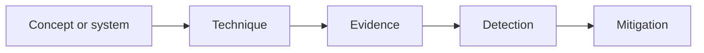

# Same-Origin Policy

> A browser security boundary that restricts how documents and scripts from different origins interact.

## Overview

A browser security boundary that restricts how documents and scripts from different origins interact. This page is part of the Phase 2 knowledge graph and is intentionally concise enough to remain maintainable in GitHub Markdown.

## Why It Matters

Security decisions become more reliable when terminology, trust boundaries, evidence, and ownership are explicit. Connect this page to the linked tools, techniques, technologies, labs, and controls before acting on an observation.

## Core Principles

* Define scope, assumptions, and authorization before collecting or changing anything.
* Prefer least privilege, secure defaults, measurable evidence, and reversible lab work.
* Treat automated results as observations that require validation and documented uncertainty.

## How It Works

Use the relationship metadata as a curriculum map: understand the concept, select an authorized technique, observe the relevant technology, practice in a safe lab, then interpret detection and mitigation.

## Architecture / Diagram

## Security Relevance

The security relevance depends on the system’s trust boundaries, data sensitivity, identity model, exposure, and operational controls. Use authoritative references and local evidence rather than assumptions.

## Common Security Issues

Common issues include excessive trust, unclear ownership, unsafe defaults, insufficient validation, missing telemetry, and controls that are not tested after change.

## Related Vulnerabilities

No direct mapping recorded; verify the implementation context.

## Related Techniques

No direct mapping recorded.

## Related Tools

No direct mapping recorded.

## Related Technologies

No direct mapping recorded.

## Related Labs

Use a disposable, owned, or explicitly authorized environment.

## Defensive Perspective

Defenders should identify the relevant logs, identity events, network records, endpoint signals, cloud audit data, and configuration state. Mitigation should reduce exposure and be verified with a repeatable test.

## Common Mistakes

* Treating a taxonomy label as proof of a vulnerability or incident.
* Omitting data provenance, timestamps, or scope from evidence.
* Introducing production data or unrelated targets into a learning exercise.

## Further Learning

Follow the linked learning paths and authoritative standards. Revisit this page when the upstream specification or taxonomy changes.

## References

* [Authoritative source](https://developer.mozilla.org/en-US/docs/Web/Security/Same-origin_policy)
* [NIST Cybersecurity Framework](https://www.nist.gov/cyberframework)
