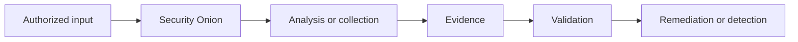

# Security Onion

> A defensive platform integrating network and host security monitoring components.

## Overview

Security Onion is a focused security tool for **security monitoring distribution**. The upstream project and documentation are linked in the metadata; verify current releases, licensing, platform support, and capabilities before production use. This page intentionally marks the entry `needs-review` until a contributor confirms the current upstream facts.

## Tool Metadata

| Property | Details |
| --- | --- |
| Category | Defensive Security |
| Subcategory | Security monitoring distribution |
| Primary purpose | A defensive platform integrating network and host security monitoring components. |
| License | Elastic License; verify upstream |
| Platforms | Linux |
| Language | Multiple |
| Verification | needs-review; verify against upstream sources |

## Purpose

Use Security Onion to answer a defined assessment, engineering, or defensive question within an owned, synthetic, local, CTF, or explicitly authorized environment. Record scope, configuration, timestamps, evidence, and limitations.

## Key Features

* Focused support for security monitoring distribution.
* Repeatable output suitable for review when configuration and scope are retained.
* Integration potential with documented security workflows; confirm exact support upstream.

## How It Works

The tool’s behavior depends on version, configuration, permissions, data quality, and environment. Output is an observation, not proof of compromise or business impact.

## Installation

Follow the official repository or documentation links above. Do not copy unverified commands or install unknown packages. Prefer a disposable virtual machine or container for learning.

## Safe Usage

Use only local fixtures, intentionally vulnerable applications, synthetic data, owned infrastructure, CTFs, or written authorized assessments. Do not test unrelated public systems, accounts, devices, or data.

## Advantages

* Provides a focused workflow for security monitoring distribution.
* Can produce repeatable evidence for review and remediation.
* Fits into a larger process rather than requiring a new data store.

## Disadvantages

* Results can be incomplete, noisy, version-dependent, or affected by defensive controls.
* Specialist interpretation may be required.
* Collection may expose sensitive information and should be minimized and protected.

## Limitations

Security Onion cannot establish authorization, attribution, exploitability, or business impact by itself. It does not replace manual validation, threat modeling, secure review, or remediation verification.

> **SECURITY / LEGAL NOTICE**
>
> Use this tool only on systems, applications, networks, accounts, devices, or data that you own or have explicit authorization to assess. Unauthorized scanning, exploitation, credential testing, interception, or access may be illegal.

## Basic Usage in a Safe Lab

Create a disposable fixture, define the smallest authorized scope, record the configuration, and preserve only the evidence needed for the learning objective.

## Intermediate Usage

In an approved assessment, compare the result with a known baseline, document false positives and false negatives, and correlate observations with asset ownership and telemetry.

## Advanced Concepts

Consider versioning, permissions, rate limits, data provenance, output validation, and operational risk before incorporating this workflow into a larger program.

## Mitigation

Use the findings to improve secure configuration, least privilege, segmentation, patching, protected logging, and remediation verification as appropriate to the system.

## Defensive Perspective

Defenders should understand the activity the tool could produce without attempting evasion. Review relevant network, application, endpoint, identity, cloud, or file telemetry and define a safe test event before relying on a detection.

## Detection and Mitigation

Monitor for activity consistent with security monitoring distribution, correlate it with approved change windows and asset inventory, and protect telemetry from unauthorized access. Reduce exposure with least privilege, secure configuration, segmentation, patching, and documented response procedures.

## Alternatives

The related tools are wazuh, zeek. Compare scope, evidence quality, platform support, maintenance, licensing, and operational risk rather than relying on unsupported benchmarks.

## Related Knowledge

### Concepts

- [Security Monitoring](../../knowledge/concepts/security-monitoring.md)
- [Networking](../../knowledge/concepts/networking.md)
- [Threat Modeling](../../knowledge/concepts/threat-modeling.md)

### Techniques

- [Threat Hunting](../../knowledge/techniques/threat-hunting.md)
- [Packet Analysis](../../knowledge/techniques/packet-analysis.md)
- [Detection Engineering](../../knowledge/techniques/detection-engineering.md)

### Technologies

- [Linux](../../knowledge/technologies/linux.md)
- [Zeek](../network-analysis/zeek.md)
- [Suricata](../network-analysis/suricata.md)

### Vulnerabilities

- [Security Misconfiguration](../../vulnerabilities/configuration/security-misconfiguration.md)
- [Sensitive Data Exposure](../../vulnerabilities/web/sensitive-data-exposure.md)

### Defensive Controls

- [Secure Logging](../../knowledge/defensive-controls/secure-logging.md)
- [Ids Ips](../../knowledge/defensive-controls/ids-ips.md)
- [Endpoint Detection](../../knowledge/defensive-controls/endpoint-detection.md)

## References

* [Security Onion official repository](https://github.com/Security-Onion-Solutions/securityonion)
* [Security Onion official website](https://securityonionsolutions.com/)
* [Security Onion official documentation](https://docs.securityonion.net/)
* [NIST Cybersecurity Framework](https://www.nist.gov/cyberframework)
