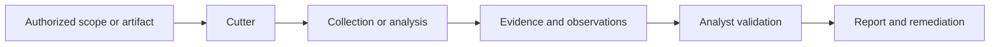

# Cutter

> Graphical binary analysis. This page is written for lawful, authorized security education.

## Overview

**Cutter** is used for a visual interface for reverse-engineering workflows powered by the rizin ecosystem. Its value depends on clear authorization, a defined scope, and a documented assessment objective. It should be treated as one component of a broader workflow rather than as proof that a finding is exploitable or material.

The project’s upstream repository, official website, and documentation are linked in the metadata above. Maintenance status, release versions, and feature details can change; verify those items upstream before relying on them in production.

## Tool Metadata

| Property | Details |
| --- | --- |
| Category | Reverse Engineering |
| Subcategory | Reverse-engineering GUI |
| Primary purpose | Graphical binary analysis |
| License | GPL-3.0 |
| Open source | Verify upstream; edition and component terms may differ. |
| Platform | Linux; Windows; macOS |
| Language | C++; Qt |
| Repository | [Cutter repository](https://github.com/rizinorg/cutter) |
| Official website | [https://cutter.re/](https://cutter.re/) |
| Documentation | [https://cutter.re/docs/](https://cutter.re/docs/) |
| Current version | Not recorded here; verify upstream. |
| Difficulty | Intermediate |
| Security domain | Reverse Engineering; Reverse-engineering GUI |
| Defensive / offensive / both | Both; use only within authorization. |

## Purpose

Use Cutter when the assessment question matches **graphical binary analysis**. A professional workflow normally records the asset or artifact, authorization, time window, operator, configuration, result, confidence, and remediation owner.

## Key Features

* A visual interface for reverse-engineering workflows powered by the Rizin ecosystem.
* Structured output or evidence that can be reviewed by another analyst, subject to the tool’s actual capabilities and configuration.
* Integration into a larger workflow through documented files, APIs, plugins, or reports where supported upstream.
* Repeatable use in a local lab or approved environment with explicit scope and rate controls.

## How It Works

At a high level, the workflow is:

The inputs, processing model, and outputs vary by version and configuration. Treat output as an observation that requires validation, not as an automatic vulnerability, attribution, or compromise conclusion.

## Installation

Use the official installation guidance linked in **Tool Metadata**. Package names, binaries, dependencies, and supported platforms can change. Do not copy installation commands from unverified third-party pages. For a safe learning environment, prefer a disposable virtual machine, container, or operating-system package that you can update and remove.

## Basic Usage in a Safe Lab

Start with a local service, synthetic file, packet capture, test account, intentionally vulnerable application, or other artifact that you own. Define the scope before launching the tool, keep request or capture rates conservative, and save the output with a timestamp. Do not use unrelated public domains, addresses, accounts, or data as examples.

## Intermediate Usage

In an approved assessment, connect the tool’s output to an asset inventory and a repeatable evidence process. Record the exact scope, configuration, exclusions, timestamps, relevant output, analyst interpretation, and a remediation recommendation. Common mistakes include treating a match as proof, overlooking false positives, ignoring rate limits, and failing to protect collected data.

## Advanced Concepts

Advanced use should focus on measurement quality, reproducibility, parser or rule review, coverage gaps, and the relationship between collection and defensive telemetry. Where the tool supports automation, test it against a controlled fixture first and add a stop condition. Avoid evasion, persistence, credential abuse, destructive actions, and any activity against uninvolved systems.

## Real-World Use Cases

Legitimate uses include security audits, vulnerability management, incident response, asset inventory, threat hunting, secure development, compliance evidence, and security research performed under written authorization. The correct use case depends on the tool configuration and the organization’s rules of engagement.

## Advantages

* Focused workflow for graphical binary analysis.
* Useful evidence for review when outputs are retained with scope and configuration.
* Can support repeatable lab exercises and documented professional processes.
* Benefits from the upstream project’s ecosystem; verify current integrations and maintenance status.

## Disadvantages

* Results may contain false positives, false negatives, or incomplete coverage.
* Performance and behavior depend on target size, configuration, network conditions, and version.
* Some capabilities require specialist knowledge, elevated permissions, or edition-specific features.
* Collection may expose sensitive data and can trigger defensive controls even when authorized.

## Limitations

Cutter cannot replace authorization, asset ownership, threat modeling, manual validation, secure coding review, incident-response judgment, or remediation verification. It does not establish attribution or business impact by itself.

> **SECURITY / LEGAL NOTICE**
>
> Use this tool only on systems, applications, networks, accounts, devices, or data that you own or have explicit authorization to assess. Unauthorized scanning, exploitation, credential testing, interception, or access may be illegal.

## Defensive Perspective

For reverse engineering, defenders should understand the observable activity without attempting to evade it. Record hashes, process trees, file writes, network attempts, and analyst actions in the lab. Use signed software, allowlists, sandboxing, patching, and supply-chain provenance controls.

## Detection

Record hashes, process trees, file writes, network attempts, and analyst actions in the lab. Useful telemetry may include application or service logs, DNS and network records, endpoint process events, identity events, cloud audit logs, or file-integrity data, depending on the tool and the environment. Establish a known-good baseline before interpreting anomalies.

## Mitigation

Use signed software, allowlists, sandboxing, patching, and supply-chain provenance controls. Document ownership, severity, compensating controls, and verification criteria. Re-test only within the approved scope.

## Alternatives

| Tool or method | Best for | Difficulty | License |
| --- | --- | --- | --- |
| Ghidra | A related workflow or comparison point | Verify upstream | Verify upstream |
| Radare2 | Complementary analysis | Verify upstream | Verify upstream |
| Binary Ninja | Validation or defense | Verify upstream | Verify upstream |

## Comparison Guidance

Compare tools using scope control, coverage, evidence quality, platform support, maintainability, reporting, integration, and total operational risk. Do not infer benchmark results from this page; measure in a representative authorized lab when performance matters.

## When to Use

Use Cutter when the objective is clearly defined, the data or target is authorized, the expected output is understood, and a reviewer can reproduce the observation.

## When Not to Use

Do not use it against unrelated public infrastructure, personal accounts, production systems without approval, or data that you are not permitted to collect. Choose another method when the question requires a different evidence source or when the tool’s coverage is not appropriate.

## Common Mistakes

* Starting without written scope, an owner, or a stop condition.
* Treating an automated result as a confirmed finding.
* Failing to record configuration, version, timestamps, and exclusions.
* Exposing collected data in tickets, logs, or public repositories.
* Ignoring maintenance status, licensing, platform constraints, or downstream risk.

## Safe Practice Lab

Use a local virtual machine, disposable container, synthetic dataset, packet capture, or intentionally vulnerable platform such as **OWASP Juice Shop**, **DVWA**, **WebGoat**, or a CTF environment. Keep the lab isolated, use test identities, and destroy or reset it after the exercise. Analyze software you own or are authorized to research, preferably in an isolated non-production environment with samples treated as untrusted.

## Learning Exercises

1. **Beginner:** Identify the tool’s scope, inputs, outputs, and one limitation using a local lab fixture.
2. **Intermediate:** Repeat the exercise with documented configuration, timestamps, and a false-positive review.
3. **Advanced:** Map an observation to a defensive control, detection source, remediation owner, and verification test.

## Related Concepts

* Reverse Engineering
* Reverse-engineering GUI
* Authorization and rules of engagement
* Evidence handling and reproducibility
* Detection and mitigation

## Related Tools

See the related category index in [`tools/reverse-engineering/README.md`](../reverse-engineering/README.md) and compare with the alternatives listed above.

## Related Defensive Controls

* Asset inventory and least privilege
* Network or workload segmentation
* Centralized, access-controlled logging
* Secure configuration and patch management
* Detection validation and incident-response procedures

## Related Labs

* [`labs/README.md`](../../labs/README.md)
* [`Localhost network and service inventory`](../../labs/networking/localhost-service-inventory.md)
* [`Evidence-first analysis workflow`](../../labs/forensics/evidence-first-analysis.md)

## References

1. [Cutter official repository](https://github.com/rizinorg/cutter)
2. [Cutter official website](https://cutter.re/)
3. [Cutter official documentation](https://cutter.re/docs/)
4. [NIST Cybersecurity Framework](https://www.nist.gov/cyberframework)
5. [OWASP Web Security Testing Guide](https://owasp.org/www-project-web-security-testing-guide/)

> Verify upstream documentation for current versions, installation instructions, capabilities, licenses, and platform support before use.
## Related Knowledge

### Concepts

- [Threat Modeling](../../knowledge/concepts/threat-modeling.md)
- [Security Monitoring](../../knowledge/concepts/security-monitoring.md)
- [Attack Surface](../../knowledge/concepts/attack-surface.md)

### Techniques

- [Static Analysis](../../knowledge/techniques/static-analysis.md)
- [Dynamic Analysis](../../knowledge/techniques/dynamic-analysis.md)
- [Reverse Engineering](../../knowledge/techniques/reverse-engineering.md)

### Technologies

- [Linux](../../knowledge/technologies/linux.md)
- [Windows](../../knowledge/technologies/windows.md)
- [macOS](../../knowledge/technologies/macos.md)
- [C](../../knowledge/technologies/c.md)

### Vulnerabilities

- [Container Security](../../vulnerabilities/cloud/container-security.md)
- [Supply Chain Vulnerabilities](../../vulnerabilities/supply-chain/supply-chain-vulnerabilities.md)

### Labs

- [Localhost Service Inventory](../../labs/networking/localhost-service-inventory.md)
- [Packet Capture Fundamentals](../../labs/networking/packet-capture-fundamentals.md)

### Defensive Controls

- [Endpoint Detection](../../knowledge/defensive-controls/endpoint-detection.md)
- [Secure Logging](../../knowledge/defensive-controls/secure-logging.md)
- [Secure Configuration](../../knowledge/defensive-controls/secure-configuration.md)

### Related Tools

- [ghidra](ghidra.md)
- [radare2](radare2.md)
